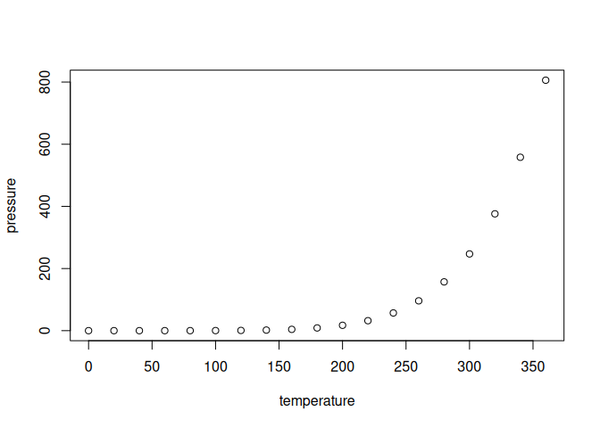

Clase 1
================

- [Tipos de datos en R](#tipos-de-datos-en-r)
  - [Datos básicos](#datos-básicos)
    - [Asignaciones de variables](#asignaciones-de-variables)
  - [Estructuras](#estructuras)
    - [Vectores](#vectores)
- [Including Plots](#including-plots)
  - [ESTO SE VA A ROMPER](#esto-se-va-a-romper)

## Tipos de datos en R

### Datos básicos

Los tipos de datos básicos que tenemos en R son:

- ‘logical’: las posibles valores son `TRUE` o `FALSE`. **Importante:**
  R es sensible a mayusculas.
- ‘character’: una secuencia de caracteres (puede ser solo uno), se
  escribe entre comillas simples o dobles `"Hola mundo"`.
- ‘numeric’: un numero con decimeales. Es importante que utilicemos el
  punto como separador `3.1415`.
- ‘integer’: un número entero.
- ‘complex’: un número complejo `3-2i`.
- ‘raw’: es una sequencia de bits.

#### Asignaciones de variables

Para asignar el valor a una variable, se utiliza el símbolo el operador
de asignación (‘\<-’), apuntando hacia el objeto que recibe el valor.
Por ejemplo, le asignamos a la variable x el valor 2.

``` r
x <- 2
```

**Importante:** Si en una instancia posterior del código realizamos otra
asignación hacia la variable x, perderemos el valor 2 asignado
previamente.

### Estructuras

Las variables son objetos en R que tienen dos atributos: la clase
(`mode`) y la estructura (`structure`).

Las estructuras mas utilizadas son:

- Los vector son estructuras de una dimensón que puede contener
  elementos del mismo tipo.
- Las matrices son estructuras de 2 dimensiones compuestas por vectores
  que podemos considerarlos las filas o columnas. Es una estructura útil
  para realizar cálcuos algebraicos.
- Los data frames son una estructura de dos dimensiones porque nos
  permite almacenar datos de distinto tipo en cada columna, ya no
  estamos ante una matriz sino ante una tabla. Las columnas son de un
  data frame son vectores (todos los datos de una columna deben ser del
  mismo tipo).
- Las listas son estructuras versatiles de una dimensión que permiten
  almacenar dentro elementos de distinto tipos incluidos data frames y
  listas.

#### Vectores

R trabaja sobre estructuras de datos. La estructura más simple es un
vector numérico, que consiste en un conjunto ordenado de números. Cuando
asignamos un valor a una variable, estamos creando un vector de
dimensión 1.

Para crear vectores de dimensión mayor se utiliza el comando `c()`. Por
ejemplo, para asignarle a la variable y un vector que contenga los
valores 3, 6 y 2 haremos

``` r
y <- c(3,6,2)
```

Para saber qué valores tiene la variable y, la imprimimos.

``` r
print(y)
```

    ## [1] 3 6 2

Si bien el comando `<-` es el más utilizado, existen otras formas de
asignación de variables. Podemos utilizar el comando
`assign("variable", valor)`.

``` r
assign("x", c(1.3, 2.5, 4.2, 9.7, 8.1))
print(x)
```

    ## [1] 1.3 2.5 4.2 9.7 8.1

Notar que ahora x ya no vale 2.

cualquier boludez

You can include R code in the document as follows:

``` r
summary(cars)
```

    ##      speed           dist       
    ##  Min.   : 4.0   Min.   :  2.00  
    ##  1st Qu.:12.0   1st Qu.: 26.00  
    ##  Median :15.0   Median : 36.00  
    ##  Mean   :15.4   Mean   : 42.98  
    ##  3rd Qu.:19.0   3rd Qu.: 56.00  
    ##  Max.   :25.0   Max.   :120.00

## Including Plots

Acá mejor no incluir gráficos.

You can also embed plots, for example:

<!-- -->

Note that the `echo = FALSE` parameter was added to the code chunk to
prevent printing of the R code that generated the plot.

En el mismo lugar, como digjo el Torta!!!

### ESTO SE VA A ROMPER

Si estamos escribiendo en el mismo lugar, no deberia saber en que orden
poner las cosas.
